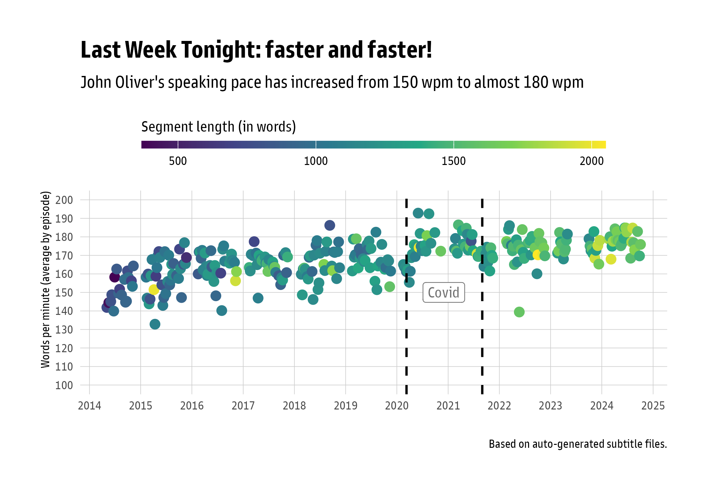

```{r setup, message=FALSE, echo=TRUE, collapse=TRUE}
knitr::opts_chunk$set(echo = FALSE, collapse=TRUE)

# load libraries
library(tidyverse)
library(here)
library(broom)
library(knitr)
library(kableExtra)

# load raw data
alignments <- read_tsv(here("data", "alignments.csv"))
episodes <- read_tsv(here("data", "episodes.csv"))

# set theme
theme_set(hrbrthemes::theme_ipsum_gs())
```

## The mystery

I recently stumbled across an old John Oliver episode from Season 1. The pace of that episode was *noticeably* slower — so slow in fact that I thought I had YouTube on half speed.

**My interest was piqued: has John Oliver become more ~~angry~~ fast-paced over time?**

(For social media attention I asked **"Has John become more *angry*?"** — but I'm a data scientist, not a loudmouthed journalist, so we'll leave *that* inference to someone else. It'll take the expertise of a phonetician to comment on that.)

### The short story

Has John's speed become faster?

Yes, it has. And by *a lot*.

Over the first 11 seasons, John's speech has accelerated from an average of **150 to almost 180 words per minute**.


*If anyone's rightfully and critically wondering: yes, starting the y-axis above 0 can be bad and deceptive practice. However, 100 wpm is the far more natural starting point for speaking pace than 0 — or at least I should hope so! In other words, the y-axis starts with "slow speech".*

For comparison: **100—120 wpm** is [generally considered](https://virtualspeech.com/blog/average-speaking-rate-words-per-minute) as "slow", **120—150** as "conversational", and by **200+**, we're talking auctioneer-like style. A speaking rate of 160 is a threshold for comfortably hearing and processing complex information. There is, after all, a recommendation to keep presentations to between 100—150 wpm.

John's increase is **really** noticeable — and let's keep in mind that it is measured across comedy segments with considerably more space taken by audience reactions than your average TED talk or business presentation.

Moving on — let's dive straingt in to our main story!

---

**The key insights:**

* There is a **significant** increase in speed over time.
* Pauses between words are **decreasing**.
* During Covid, when John was broadcasting without an audience, the averages are slightly higher — and episodes with low-ish speech rate are absent. This probably reflects the absence of interruptions by audience reactions; the period otherwise continues the overall trend.
* The length of the main segments *also* increases over time — but is not a confounding factor.

---

### The slightly longer story

**Task**: In general, dealing with questions and data of this type are straightforward corpus linguistic tasks: we can count words and then calculate the rate of speech in **words per minute** at the episode-level. With more advanced NLP tools, we can measure **syllables per second** and **pauses between words** at the word-level. The word-level is the more fine-grained approach that allows us to exclude the effects of, for example, longer phases of silence.

**Challenge**: How do we deal with artifacts in the data unrelated to changes in speech style? For example, indicated by the color of the dots, it is clear that the length of the main segment in *Last Week Tonight* has also increased over time. In statistical terms, that could be a confounding factor — an unrelated factor that influences the effect of the main factor of interest. It could well be that in longer segments, breaks and intros/outros are are relatively less influential.

Let’s see.

## Data & processing

Using [yt-dlp](https://github.com/yt-dlp/yt-dlp), I fetched the audio, the auto-generated subtitles and file meta data such as file duration from a [list of 314 episodes of Last Week Tonight](https://en.wikipedia.org/wiki/List_of_Last_Week_Tonight_with_John_Oliver_episodes) from the first 11 seasons. The data is based on the *main segments* of each episode, which range in duration from 6 to 34 minutes.

The raw data for episode- and word-level data is [here](https://github.com/skeptikantin/johnoliver/tree/main/data).

*Note: To assess if other people's contributions affected the patterns, I manually checked about two dozen randomly chosen transcripts. Non-John data did in fact change the numbers, but in the **other** direction — John's speaking rate would be even **higher**.

## Analysis

### Simple: Episode-level

For the graph above, I used the simplest possible method, counting rate of speaking in words per minute from a table that looks like this:

```{r episodes_inspect, echo=TRUE, collapse=TRUE}
# subset episodes, rename columns for readability, and determine wpm speech rate
episodes_clean <- episodes |> 
  select(season, episode_total, main_segment, duration, length, wrds) |> 
  rename(Season = season,
         Episode = episode_total,
         Title = main_segment,
         Duration = duration,
         Length = length,
         Words = wrds) |> 
  mutate(`Words per minute` = Words/(Length/60))

# output table
episodes_clean |> 
  head(10) |> 
  kable(digits = 0, caption = "Episode list for the first 10 episodes in Season 1.") |> 
  kable_styling(
    full_width = FALSE,
    bootstrap_options = c("striped", "hover", "condensed")) |> 
  row_spec(0, bold = TRUE, color = "white", background = "grey40")
```

---

### Advanced: Word-level

At the **word-level**, we can exclude some of the artefacts that make the episode-level is affected more by text composition or other data quality issues. Because if we measure **syllables per second** for each word or the **pause between words**, then it is irrelevant how much time is spent for silent periods.

So, for a random 108 segments, I used [Gentle](https://github.com/lowerquality/gentle) to force-align the audio files with their subtitles. Gentle tries to determine the beginning and the end of each word, from which we can calculate its duration.

Gentle works reasonably well on audio files longer than a few seconds — while it comes at the cost of accuracy, patterns should be clear enough in over 370,000 measured words.

The package {nsyllables} counts the syllables per word, from which we calculate syllables per second of that particular word. From the difference between the end of one word and the beginning of the next word, we can calculate the pause.

This table illustrates this process for Episode 18 in Season 8, ["Housing Discrimination"](https://youtu.be/_-0J49_9lwc?si=jkoQM6E-U-Rec9mZ) (the main segments generally begin with a shortened 4s intro):

```{r alignments_transform, echo=TRUE, collapse=TRUE}
# adds duration, pauses, medians
alignments <- alignments |> 
  group_by(ep_id) |> 
  # normalize 
  mutate(beg = round(beg, 4),
         end = round(end, 4)) |> 
  mutate(pause = lead(beg) - end,
         dur = end - beg) |> 
  mutate(syl = nsyllable::nsyllable(word)) |> 
  mutate(sps = (1/dur)*syl) |> 
  ungroup()

# illustrate for one episode
alignments |> 
  filter(ytid == '_-0J49_9lwc') |> 
  # column names that are better to read
  rename(Date = ytdate, 
         Word = word,
         Recognised = recog,
         `No of syllables` = syl,
         Begin = beg,
         End = end,
         Duration = dur,
         `Syllables per second` = sps,
         `Pause to next word` = pause) |> 
  select(Word:End, Duration, `Pause to next word`, `No of syllables`, `Syllables per second`) |> 
  head(12) |> 
  kable(digits = 2, caption = "Forced-alignment. NA result from alignment errors'.") |> 
  kable_styling(
    full_width = FALSE,
    bootstrap_options = c("striped", "hover", "condensed")) |> 
  row_spec(0, bold = TRUE, color = "white", background = "grey40") |> 
  # highlight rows with alignment errors
  row_spec(3:4, color = "grey70")
```

If we average over all words in each of the 108 force-aligned files, we get a word-level confirmation of the episode-level hunch that that speech in particular and episodes in general have become more face-paced: words are spoken quicker and there are fewer pauses between the words themselves:

```{r alignments_summary, fig.height = 6, fig.width = 8}

# each segment's summary
alignments_summ <- alignments |> 
  # filter durations of less than 0.2 (file-level alignment errors):
  filter(dur > 0.19 | is.na(dur)) |> 
  group_by(season, ep_id, ytdate, ytid) |> 
  summarize(words = n(),
            sum_na = sum(is.na(beg)),
            align_errors = sum_na/words,
            sps_mean = mean(sps, na.rm = T),
            pause_mean = mean(pause, na.rm = T),
            .groups = "drop_last") |> 
  ungroup()

# plot
alignments_summ |> 
  # exclude episodes where the mean of pauses is greater than 200ms
  filter(pause_mean < .20) |> 
  select(ytdate, ep_id, align_errors, pause_mean, sps_mean) |> 
  # pivot longer to make a facet plot
  pivot_longer(pause_mean:sps_mean,
               names_to = "metric",
               values_to = "value") |> 
  # change order of metrics to have syllables first in plot
  mutate(metric = factor(metric, levels = c("sps_mean", "pause_mean"))) |> 
  # change from seconds (decimal) to milliseconds
  mutate(value = if_else(metric == "pause_mean", value * 1000, value)) |>
  # scatterplot
  ggplot(aes(ytdate, value)) +
  geom_point(color = "#21918c", size = 2) +
  geom_smooth(method = "lm", color = "#b73779", formula = y ~ x) +
  facet_wrap(~metric, scale = "free_y", #nrow = 2,
             labeller = as_labeller(c(sps_mean = "Syllables per second", pause_mean = "Pause duration (milliseconds)"))) +
  labs(title = "More syllables per second and shorter pauses",
       subtitle = "Additional indicators of faster speaking rate over time\nthat are independent of show segment properties",
       x = '',
       y = '',
       caption = "108 episodes with forced-alignment") +
  scale_x_date(date_breaks = '1 year', date_labels = "%Y") +
  theme(panel.grid.minor = element_blank())
```

Note that in connected speech, at the phrase level, the pause between words is normally 0, so an average decrease from 120ms to 90ms also suggests John is concatenating his phrases and sentences more quickly:

It is also worth noting that the regression line for syllables per word (shown) is near identical using `method = "gam"` (which would identify a non-linear relationship between **syllables per word** and time). So let's turn to a linear model.

## Predictive modelling

While by now we have a pretty good indication that the initial hunch was correct — both by the simple analysis above and by the auditory impression alone — we can use this data set to illustrate the advantage of linear regression. Because at face value, all we have in data or stats terms is: "an increase in words per minute" **and** "an increase in amount of text". In other words, technically, we still don't know if the increase in *words per minute* is an artifact of the *increase in amount of text*.

We could model (or predict) either `words per minute` or `syllables per second`. The latter is more fine-grained and truer to the original question. However, being at the word-level, it also has more data points, and is thus also vastly more complex to perform — we would have to control for the length of the word or the words itself (of which there are over 22,000).

If, on the other hand, we predict the aggregate `syllables per seconds` from the episode-level, we only have roughly a third of the data points (108) than we have for `words per minute` (294).*

\**The discrepancy between 294 usable data points to 314 files comes from excluding segments where the force-alignment was too bad to be usable*

### Correlations & variable selection

In the current case it seems clear which factors to model — we want to predict `wpm` (as a proxy of speaking rate) from `season` as a proxy for time, controlled for `length` of segments.

But for the sake of illustration, let's include a couple more. They also explain why some files were excluded for the analysis.

We also include:

* `ep_within`, which is the number of an episode within a season (excluding 6 files with numbers that occur only in one season),
* `align_errors`, which is the proportion of words in a file which Gentle could not measure beginning and end for, and,
* `pause_mean`, which is the average pause between words in a segment.

**A correlation matrix shows:**

1. The main factors of interest — `wpm`, `length` and `season` — are all highly correlated (as expected)
2. Errors in alignment (`align errors`) and pauses between words (`pause_mean`) are also strongly correlated — that strong correlation is mainly due to a handful of files with extreme alignment errors.
3. The episode within a season is not correlated with any other variable — and can be used as a proxy to "test" if speech rate is associated with "training effects" within a season. There is, however, no reason to believe that this should be an influencing factor (cuz, why?).

```{r correlate_epi-wrd, fig.height = 5, fig.width=5, message=FALSE, warning=FALSE}
# combine episode- and word-level data
comb_dat <- episodes |> 
  select(ep_id, season, episode_total, period, ytdate, wrds, length) |> 
  left_join(alignments_summ |> select(ep_id, sps_mean, pause_mean, align_errors), join_by("ep_id")) |> 
  mutate(wpm = wrds/length*60, .after = length) |> 
  # remove column wrds (was only necessary to calculate wpm)
  select(-wrds) |> 
  filter(!is.na(ytdate)) |>
  # episode within
  group_by(season) |> 
  mutate(ep_within = row_number()) |> 
  mutate(period = factor(period, levels = c("precovid", "covid", "post_covid"))) |> 
  ungroup() |> 
  # filter out 6 episodes whose episode number within a season is unique
  filter(ep_within <= 30)

# make model data
mod_dat <- comb_dat |>
  select(season, period, ep_within, wpm, sps_mean, length, pause_mean, align_errors) |> 
  # season could technically also be transformed, but leave untouched to get 'raw' effect
  mutate(length = as.numeric(scale(length)),
         ep_within = as.numeric(scale(ep_within)),
         align_errors = as.numeric(scale(align_errors)),
         sps_mean = as.numeric(scale(sps_mean)),
         pause_mean = as.numeric(scale(pause_mean))) |> 
  filter(!is.na(wpm))

# plot a correlation matrix
mod_dat |>
  select(where(is.numeric)) |>
  cor(use = "pairwise.complete.obs") |> 
  ggcorrplot::ggcorrplot(
    hc.order = TRUE,   # hierarchical clustering order
    type = "lower",    # show only lower triangle
    lab = TRUE,        # show correlation values
    lab_size = 4) +
  labs(x = NULL, y = NULL,
       title = "Correlation between several predictors") +
  hrbrthemes::theme_ipsum_gs() +
  theme(plot.margin = margin(2, 2, 2, 2),
        plot.title = element_text(margin = margin(b = 5)))

```

The second point makes either `align_errors` or `pause_mean` statistically less or even unsuitable, but it also shows, on closer inspection, that we should exclude the data for files with a particularly high proportion of alignment errors — reducing our already small sample size.

### Linear model

Our simple model is `wpm ~ season + length + ep_within`.

``` {r modelling, fig.height = 5, fig.width=5, warning=FALSE}
# remove alignment errors - average pauses greater than 200ms
mod_dat_sps <- mod_dat |> 
  filter(pause_mean < .20)

# very simple linear model
mod_wpm <- lm(wpm ~ season + length + ep_within, data = mod_dat)

#performance::model_performance(mod_wpm)
#performance::check_model(mod_wpm)
#performance::check_heteroscedasticity(mod_wpm)
#performance::check_collinearity(mod_wpm)

# get model summary stats
broom::tidy(mod_wpm) |>
  knitr::kable(
    digits = 3,
    caption = "Linear model summary (wpm ~ season + length + ep_within)") |>
  kableExtra::kable_styling(
    full_width = FALSE,
    bootstrap_options = c("striped", "hover")) |> 
  row_spec(1, color = "grey70") |>
  row_spec(2, color = "#90d743", bold = TRUE) |> 
  row_spec(3, color = "grey40") |> 
  row_spec(4, color = "grey40")

```

The variance explained by those three predictors (*R*^2^ = 0.37) is rather moderate — although I'm used to far lower values in linguistics. This is usually the result of complexity that is operationalised in extreme simplicity. Model performance also detected no issue, suggesting the linear model is adequate for this data set.

In essence: only `season` is a significant predictor of `wpm`. Neither the increased length of a segment over time, nor the number of an episodes in a season are associated with the increased speaking rate. Their inclusion was to serve as control variables anyway.

Since `season` was not transformed, we can interpret its estimate (or coefficient) directly and in 'raw' terms: on average, with every **season**, John increased his speech rate **2.3 words per minute**. Since we have 11 seasons, that is a rather intuitive statistical confirmation of the eye-balled 25 wpm increase from 150 to just shy of 180 wpm.

## Concluding remarks

Overall, the auditory impression is confirmed. The actual numbers — 25 wpm more in 2024 than in 2025 — are quite shaky, given how coarse-grained they were measured. Let's not forget that this average is measured across an entire episode, including intros/outros, audience reactions, pauses for dramatic effect, or the segments of other people. In general, this 'noise' is assumed to be relatively constant across episodes, but they probably 'drag' the average down a bit.

As for the reasons — pure speculation, and not my area of expertise at all.

An natural reaction is that John is indeed also angrier — we intuitively associate more emotional speech with greater speed. And there is after all a significant level of stuff that's been getting worse since 2014.

Whether emotion of this kind can be measured in this data? May be. It'll probably need some form of pitch analysis, and a skilled computational phonetician to get something out of audio files of poor quality. A topic-modelling analysis might be interesting - whether more political topics (how define?) are associated with different, more emotional speech styles. But that's for another day.

## Appendix

This code generated the graph at the beginning:

```{r main graph, echo=TRUE}
# For wpm on episodes:
episodes <- episodes |> 
  mutate(viewers_m = viewers * 1000000,
         wpm = wrds/length * 60,
         spm = syls/length,
         vlr = likes/views,
         vcr = comms/views)

# plot
episodes |> 
  filter(!(is.na(wpm))) |> 
  # this episode is an outlier - with Vietnamese subtitles...
  filter(ytdate != "2021-08-16") |> 
  select(wpm, ytdate, wrds, length, period) |> 
  # plot
  ggplot(aes(ytdate, wpm, color = length)) +
  geom_point(alpha = 1, size = 3) +
  labs(
    title = "Last Week Tonight: faster! angrier?",
    subtitle = "John Oliver's pace has increased from 150 to almost 180 words per minute",
    x = '',
    y = 'Words per minute',
    caption = "Each dot one episode; based on 314 auto-generated subtitle files."
  ) +
  scale_color_viridis_c(option = "viridis") +
  coord_cartesian(ylim = c(100, 200)) +
  scale_x_date(date_breaks = '1 year', date_labels = "%Y") +
  scale_y_continuous(breaks = seq(100, 200, by = 10)) +
  hrbrthemes::theme_ipsum_gs() +
  theme(
    legend.position = "top",
    legend.direction = "horizontal",
    panel.grid.minor = element_blank()
  ) +
  # the legend for the segment duration (and only that legend)
  guides(
    size = "none",
    color = guide_colorbar(
      title = "Segment length (in words)",
      title.position = "top",
      direction = "horizontal",
      barwidth = unit(12, "cm"),
      barheight = unit(0.2, "cm")
    )
  ) +
  # pre-covid, covid, post-covid episode indicator
  geom_vline(
    xintercept = as.Date(c("2020-03-10", "2021-09-01")),
    linetype = "dashed",
    color = "black",
    linewidth = 0.8
  ) +
  annotate(
    "label",
    x = as.Date("2020-12-01"),
    y = 150,
    label = "Covid",
    fill = "white",
    color = "grey45"
  )

ggsave("data/graphs/LWT_overall.png", width = 7.2, height = 5, dpi = 300)
```

